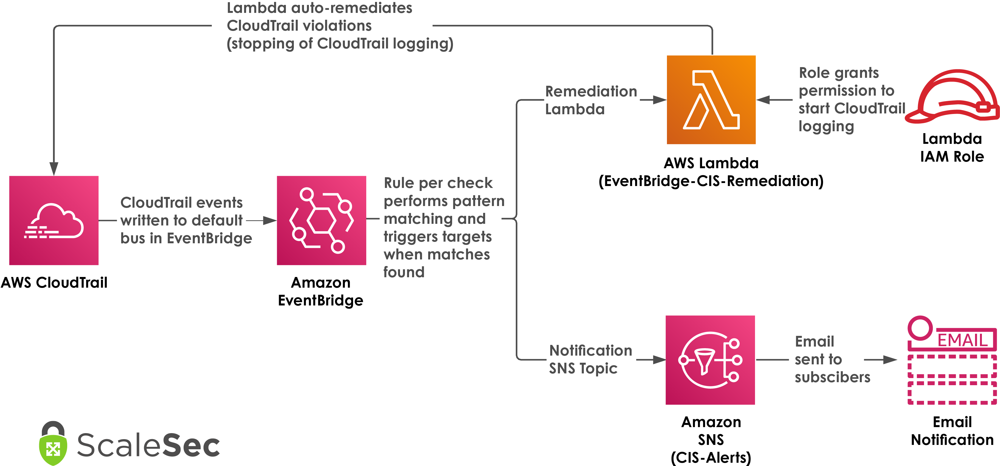

# Automating AWS CIS Benchmark Alerts and Remediation using Eventbridge
This repo contains sample code to help in deploying CIS benchmark alerts using Eventbridge instead of Cloudwatch Log Metric Filters. 

Examples have been provided in both Cloudformation and Terraform. See the README file in each sub-directory for usage instructions

## Overview
The IaC templates will deploy 14 Eventbridge rules that filter on the same events that the standard CIS Cloudwatch Log Metrics use. See [CIS AWS Foundations Benchmark controls](https://docs.aws.amazon.com/securityhub/latest/userguide/securityhub-cis-controls.html) for specific details on the benchmark and Cloudwatch Log Metric approach. The high level architecture deployed can be seen below.

When one of the Eventbridge rules are triggered it will forward the event to an SNS topic for notifications and a lambda for automated remediation (both the topic and lambda function are created by the IaC templates). 

The Lambda function performs a sample remediation for CloudTrail events. Any additional remediation actions will need to be created still.

Note that these templates are for example purposes only and the notifications and lambda remediations are not flushed out enough for immediate use in a production environment. Use the example Lamdba to expand on potential remediations depending on event type. 

## Event Pattern Filters
Below are each of the 14 filters that are applied to the Eventbridge rules. They align with CIS Benchmarks 3.1 through 3.14. Each of the filters is applied automatically through the IaC templates or can be copy and pasted if you choose to create them manually.

### 3.1 Unauthorized API calls
    {
      "source": ["aws.cloudtrail"],
      "detail-type": ["AWS API Call via CloudTrail"],
      "errorCode": ["AccessDenied", "UnauthorizedOperation"]
    }

### 3.2 Console Login without MFA
    {
      "detail-type": ["AWS Console Sign In via CloudTrail"],
      "detail": {
        "additionalEventData": {
          "MFAUsed": ["No"]
        }
      }
    }

### 3.3 Usage of Root Account
    {
      "detail-type": ["AWS Console Sign In via CloudTrail"],
      "detail": {
        "userIdentity": {
          "type": ["Root"]
        },
        "userIdentity": {
          "invokedBy": [ { "exists": false } ]
        },
        "eventType": ["AwsServiceEvent", "AwsConsoleSignIn"]
      }
    }

### 3.4 IAM Policy Changes
    {
      "source": ["aws.iam"],
      "detail-type": ["AWS API Call via CloudTrail"],
      "detail": {
        "eventSource": ["iam.amazonaws.com"],
        "eventName": [
          "DeleteGroupPolicy",
          "DeleteRolePolicy",
          "DeleteUserPolicy",
          "PutGroupPolicy",
          "PutRolePolicy",
          "PutUserPolicy",
          "CreatePolicy",
          "DeleteRolePolicy",
          "CreatePolicyVersion",
          "DeletePolicyVersion",
          "AttachRolePolicy",
          "DetachRolePolicy",
          "AttachUserPolicy",
          "DetachUserPolicy",
          "AttachGroupPolicy",
          "DetachGroupPolicy"
        ]
      }
    }

### 3.5 Cloudtrail Configuration Changes
    {
      "source": ["aws.cloudtrail"],
      "detail-type": ["AWS API Call via CloudTrail"],
      "detail": {
        "eventSource": ["cloudtrail.amazonaws.com"],
        "eventName": [
          "CreateTrail",
          "UpdateTrail",
          "DeleteTrail",
          "StartLogging",
          "StopLogging"
        ]
      }
    }

### 3.6 Console Authentication Failures
    {
      "detail-type": ["AWS Console Sign In via CloudTrail"],
      "detail": {
        "responseElements": {
          "ConsoleLogin": ["Failure"]
        }
      }
    }

### 3.7 KMS CMK Key Disablement or Deletion
    {
      "source": ["aws.kms"],
      "detail-type": ["AWS API Call via CloudTrail"],
      "detail": {
        "eventSource": ["kms.amazonaws.com"],
        "eventName": [
          "DisableKey",
          "ScheduleKeyDeletion"
        ]
      }
    }

### 3.8 S3 Bucket Policy Changes
    {
      "source": ["aws.s3"],
      "detail-type": ["AWS API Call via CloudTrail"],
      "detail": {
        "eventSource": ["s3.amazonaws.com"],
        "eventName": [
          "PutBucketAcl",
          "PutBucketPolicy",
          "PutBucketCors",
          "PutBucketLifecycle",
          "PutBucketReplication",
          "DeleteBucketPolicy",
          "DeleteBucketCors",
          "DeleteBucketLifecycle",
          "DeleteBucketReplication"
        ]
      }
    }

### 3.9 AWS Config Configuration Changes
    {
      "source": ["aws.config"],
      "detail-type": ["AWS API Call via CloudTrail"],
      "detail": {
        "eventSource": ["config.amazonaws.com"],
        "eventName": [
          "StopConfigurationRecorder",
          "DeleteDeliveryChannel",
          "PutDeliveryChannel",
          "PutConfigurationRecorder"
        ]
      }
    }

### 3.10 Security Group Changes
    {
      "source": ["aws.vpc"],
      "detail-type": ["AWS API Call via CloudTrail"],
      "detail": {
        "eventSource": ["ec2.amazonaws.com"],
        "eventName": [
          "AuthorizeSecurityGroupIngress",
          "AuthorizeSecurityGroupEgress",
          "RevokeSecurityGroupIngress",
          "RevokeSecurityGroupEgress",
          "CreateSecurityGroup",
          "DeleteSecurityGroup"
        ]
      }
    }

### 3.11 NACL Changes
    {
      "source": ["aws.vpc"],
      "detail-type": ["AWS API Call via CloudTrail"],
      "detail": {
        "eventSource": ["cloudtrail.amazonaws.com"],
        "eventName": [
          "CreateNetworkAcl",
          "CreateNetworkAclEntry",
          "DeleteNetworkAcl",
          "DeleteNetworkAclEntry",
          "ReplaceNetworkAclEntry",
          "ReplaceNetworkAclAssociation"
        ]
      }
    }

### 3.12 Network Gateway changes
    {
      "source": ["aws.vpc"],
      "detail-type": ["AWS API Call via CloudTrail"],
      "detail": {
        "eventSource": ["cloudtrail.amazonaws.com"],
        "eventName": [
          "CreateCustomerGateway",
          "DeleteCustomerGateway",
          "AttachInternetGateway",
          "CreateInternetGateway",
          "DeleteInternetGateway",
          "DetachInternetGateway"
        ]
      }
    }

### 3.13 RouteTable Changes
    {
      "source": ["aws.vpc"],
      "detail-type": ["AWS API Call via CloudTrail"],
      "detail": {
        "eventSource": ["ec2.amazonaws.com"],
        "eventName": [
          "CreateRoute",
          "CreateRouteTable",
          "ReplaceRoute",
          "ReplaceRouteTableAssociation",
          "DeleteRouteTable",
          "DeleteRoute",
          "DisassociateRouteTable"
        ]
      }
    }

### 3.14 VPC Change Filter
    {
      "source": ["aws.vpc"],
      "detail-type": ["AWS API Call via CloudTrail"],
      "detail": {
        "eventSource": ["ec2.amazonaws.com"],
        "eventName": [
          "CreateVpc",
          "DeleteVpc",
          "ModifyVpcAttribute",
          "AcceptVpcPeeringConnection",
          "CreateVpcPeeringConnection",
          "DeleteVpcPeeringConnection",
          "RejectVpcPeeringConnection",
          "AttachClassicLinkVpc",
          "DetachClassicLinkVpc",
          "DisableVpcClassicLink",
          "EnableVpcClassicLink"
        ]
      }
    }

## Limitation of Liability
Please view the [License](LICENSE) for limitations of liability. 